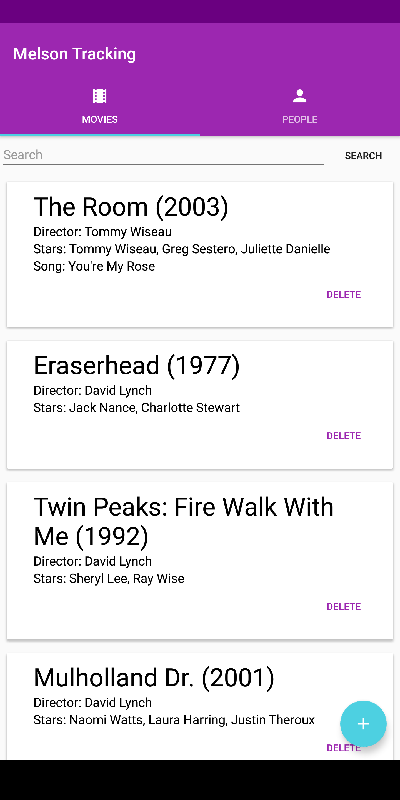
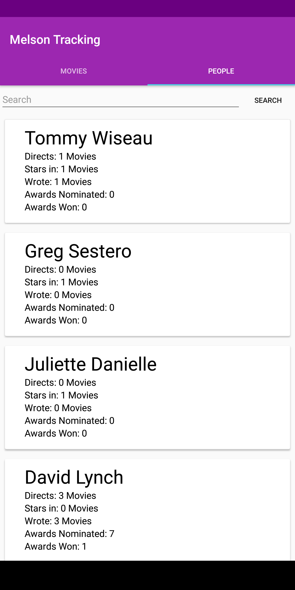

# Melson Blu Ray Tracking
The Melson Blu Ray Tracking System is an app that was developed by the team that brought you [Swoly](https://play.google.com/store/apps/details?id=com.tripidevs.swoly). This team is known as [Durian Inc](https://github.com/durian-inc). Durian is a group of college lads who are interested in many things from app development to hackathons.

This application is avalible on the following platforms:
- [x] Android
- [ ] iOS

The application has one *simple* goal. That goal is to make the user's life as easy as possible while still providing them something *_beautiful_* to navigate around. This is accomplished with a color scheme that was picked out using the [Material Design Color Tool](https://material.io/color/#!/?view.left=0&view.right=0) and incorporating other material design components such as [Cards](https://material.io/guidelines/components/cards.html) and [Floating Action Buttons](https://material.io/guidelines/components/buttons-floating-action-button.html)

## The UI
### Movies:
When first launching the application the user is presented with the movies tab.

From the movies tab there are many operations that the user can perform:
- View information on movies currently in the database.
    - Title
    - Year
    - Director
    - Stars
    - Song 
- Search for a particular movie using the search field.
- Add a movie and all of its relevant data to the database.
    - Movie information
    - Stars, director, and writer
    - Awards
    - Song featured in the movie
- Delete a movie from the database.

### People:
Swiping right-to-left on movie tab will cause the application to transition to the next tab. 

The People tab has a bit fewer features compared to the Movies tab but still has *_beautiful_* _aesthetics_. The functionaly that is available to the user on this tab includes:
- Viewing information on the people who are currently in the database.
    - Name
    - Movies they directed
    - Movies where they were a star
    - Movies they wrote
    - Number of awards where they received a nomination 
    - Number of awards they won
- Searching for a person by using the search field
- Clicking on any of the people will bring a dialog that will show more information about the person.
    - Gender
    - Awards
